 

  

  

<h3><code>~/flagship: openstore</code></h3>

**Ask your data a question in plain English and get back the SQL, a results table, and a chart.** 
An end-to-end project: ingestion, validation, layered transformation and analytics views, with a guarded AI query layer on top.

 

  

<h3><code>~/stack</code></h3>

  

<h3><code>~/more-work</code></h3>
 
 
 

  

Open to data engineering roles and projects. <a href="https://www.linkedin.com/in/danvas-osoro-26745a376/">Let's talk.</a>

